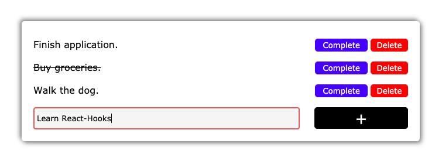
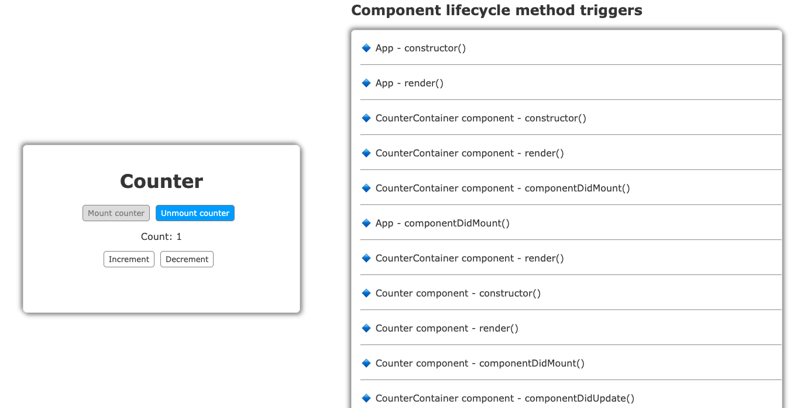

# 100-days-of-React

<table>
  <tr>
    <td>Day 1</td>
    <td>
      <h3>Simple Todo App</h3> 
      
A todo app built completely using class based components and state. [<a href="./Simple-Todo-App">Code</a>]

      <kbd></kbd>  
    </td>
    <td><i>ReactJS, Sass, Parcel, JSX</i></td>
  </tr>
  
  <tr>
    <td>Day 2</td>
    <td>
      <h3>Lifecycle Tracker</h3> 
      
A simple counter app that helps understand class based components and their different lifecycle methods. [<a href="./Lifecycle-Tracker">Code</a>]

      <kbd></kbd>  
    </td>
    <td><i>ReactJS, CSS, Parcel, JSX</i></td>
  </tr>
  
  <tr>
    <td>Day 3</td>
    <td>
      <h3>ID Card Generator</h3> 
      
An application built using functional components, with introduction to the useState hook. [<a href="./ID-Card-Generator">Code</a>]

      <kbd></kbd>  
    </td>
    <td><i>ReactJS, useState(), Sass, Parcel, JSX</i></td>
  </tr>
  
  <tr>
    <td>Day 4</td>
    <td>
      <h3>Modal</h3> 
      
A modal component with introduction to Portals, Fragments, useState and useEffect. [<a href="./Modals">Code</a>]

      <kbd></kbd>  
    </td>
    <td><i>ReactJS, useState(), useEffect(), Portals, CSS, Parcel, JSX</i></td>
  </tr>
  
  <tr>
    <td>Day 5</td>
    <td>
      <h3>Shopping Cart</h3> 
      
A simple shopping cart application built using class based components and the Context API. [<a href="./Shopping-Cart">Code</a>]

      <kbd></kbd>  
    </td>
    <td><i>ReactJS, Context API, CSS, Parcel, JSX</i></td>
  </tr>
</table>
